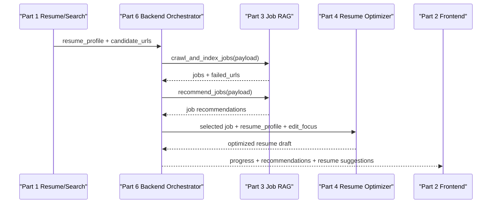

# Part 3 Calling and Integration Guide

本文档说明第 3 部分 **Browser Use + 岗位信息 RAG** 如何被其他模块调用，以及上下游模块应如何传入数据、读取结果和处理异常。

目标读者：

- 第 1 部分：简历解析 + 候选岗位搜索同学
- 第 2 部分：AI Agent 前端同学
- 第 4 部分：简历优化同学
- 第 6 部分：后端编排 + 系统集成同学
- 项目评审或后续维护人员

本文档只使用占位配置，不记录任何真实 API key、真实 base-url 或真实模型名称。

---

## 1. 本模块负责什么

第 3 部分负责把候选岗位页面和简历画像转成可解释的岗位推荐结果。

核心能力：

```text
候选岗位 URL / 本地 HTML
-> 读取页面 HTML / visible text
-> 抽取结构化岗位信息
-> 清洗、归一化、去重
-> 写入本地检索索引或 Chroma 向量库
-> 根据 resume_profile 检索更匹配的岗位
-> 输出匹配分数、匹配理由、不匹配原因、简历修改重点
```

本模块不负责：

- 不负责简历文件解析。
- 不负责生成搜索 query。
- 不负责调用搜索引擎 API。
- 不负责前端界面。
- 不负责最终改写简历全文。
- 不负责全局任务队列和用户态管理。

---

## 2. 推荐接入方式

其他模块接入时，推荐由第 6 部分后端编排模块调用本模块，而不是让前端直接调用内部函数。

推荐链路：



推荐原因：

- 第 6 部分可以统一管理 `run_id`、任务状态、日志、错误处理和缓存。
- 第 3 部分可以保持为独立 Python 模块，便于测试和替换。
- 前端只需要展示结果，不需要理解爬取、向量库和匹配细节。

---

## 3. 当前调用入口

代码位置：

```text
job_rag/api/routes.py
```

当前提供 3 个主要调用入口：

| 函数 | 类型 | 用途 |
|---|---|---|
| `crawl_jobs(payload)` | async function | 读取候选 URL，抽取并返回岗位信息，不自动写入索引 |
| `crawl_and_index_jobs(payload)` | sync function | 读取候选 URL，抽取岗位，并写入当前配置的检索索引 |
| `recommend_jobs(payload)` | sync function | 根据已建立的索引和简历画像返回岗位推荐 |

推荐最小调用顺序：

```text
1. crawl_and_index_jobs(payload)
2. recommend_jobs(payload)
```

如果后端需要更细粒度控制，也可以：

```text
1. await crawl_jobs(payload)
2. JobPosting.from_dict(...)
3. index_jobs(...)
4. recommend_jobs(...)
```

---

## 4. 输入数据契约

### 4.1 resume_profile

该结构由第 1 部分提供，本模块只消费，不生成。

推荐字段：

```json
{
  "name": "Demo User",
  "education": [
    {
      "school": "某大学",
      "degree": "本科",
      "major": "计算机科学与技术"
    }
  ],
  "skills": ["Python", "RAG", "LLM", "FastAPI", "Vector DB"],
  "projects": [
    {
      "name": "智能简历优化系统",
      "description": "基于 RAG 的岗位匹配与简历优化系统",
      "tech_stack": ["Python", "RAG", "FastAPI", "Vector DB"]
    }
  ],
  "internships": [],
  "target_roles": ["AI Agent 工程师", "算法实习生", "后端实习生"],
  "target_cities": ["北京", "上海", "杭州"],
  "salary_expectation": "面议"
}
```

字段说明：

| 字段 | 类型 | 是否建议提供 | 用途 |
|---|---|---|---|
| `education` | list[dict] | 建议 | 学历/专业匹配 |
| `skills` | list[str] | 必须 | 技能匹配、query 构造 |
| `projects` | list[dict] | 建议 | 项目相关度匹配 |
| `internships` | list[dict] | 可选 | 经验匹配 |
| `target_roles` | list[str] | 建议 | 岗位方向匹配 |
| `target_cities` | list[str] | 建议 | 城市匹配 |
| `salary_expectation` | str | 可选 | 薪资/岗位类型参考 |

注意：

- 不要传入未脱敏的身份证、手机号、住址等无关个人信息。
- 不要让本模块补充或编造简历事实。
- 如果某项信息没有解析出来，传空列表或 `null` 即可。

### 4.2 candidate_urls

该结构由第 1 部分搜索模块提供。

推荐格式：

```json
{
  "run_id": "demo_001",
  "candidate_urls": [
    {
      "url": "https://example.com/jobs/123",
      "source": "search_api"
    },
    {
      "url": "local_jobs/ai_agent_intern.html",
      "source": "demo_html"
    }
  ]
}
```

字段说明：

| 字段 | 类型 | 是否必须 | 说明 |
|---|---|---|---|
| `run_id` | str | 建议 | 后端任务追踪 ID |
| `candidate_urls` | list[dict] | 必须 | 候选岗位链接列表 |
| `candidate_urls[].url` | str | 必须 | 支持 `http`、`https`、`file` 和本地 demo 相对路径 |
| `candidate_urls[].source` | str | 可选 | 来源标识，例如 `search_api`、`manual`、`demo_html` |

合规要求：

- URL 必须是公开可访问页面。
- 不允许绕过登录、验证码、付费墙、访问限制或反爬机制。
- 不建议一次传入大量 URL；demo 和评测阶段建议 5 到 20 个。

---

## 5. 输出数据契约

### 5.1 crawl_and_index_jobs 返回

调用：

```python
from job_rag.api.routes import crawl_and_index_jobs

result = crawl_and_index_jobs({
    "run_id": "demo_001",
    "candidate_urls": [
        {"url": "local_jobs/ai_agent_intern.html", "source": "demo_html"}
    ]
})
```

返回结构：

```json
{
  "run_id": "demo_001",
  "status": "success",
  "jobs": [
    {
      "job_id": "job_001",
      "url": "https://example.com/jobs/123",
      "source": "search_api",
      "title": "AI Agent Intern",
      "company": "Example AI Lab",
      "location": "Beijing",
      "city": "Beijing",
      "salary": "200-300/day",
      "salary_min": 200.0,
      "salary_max": 300.0,
      "salary_unit": "day",
      "job_type": "Internship",
      "education_required": "Bachelor or above",
      "experience_required": "No strict requirement",
      "responsibilities": ["Build browser automation workflows."],
      "requirements": ["Familiar with Python, LLM, RAG."],
      "skills": ["Python", "LLM", "RAG", "Vector DB"],
      "raw_text": "...",
      "extraction_confidence": 1.0,
      "is_valid": true,
      "validation_errors": []
    }
  ],
  "failed_urls": []
}
```

重点字段：

| 字段 | 用途 |
|---|---|
| `jobs[].job_id` | 后续推荐、简历优化、前端展示的岗位唯一 ID |
| `jobs[].title` | 岗位名称 |
| `jobs[].company` | 公司 |
| `jobs[].location` / `city` | 地点与归一化城市 |
| `jobs[].salary` / `salary_min` / `salary_max` | 薪资原文与解析值 |
| `jobs[].responsibilities` | 岗位职责 |
| `jobs[].requirements` | 任职要求 |
| `jobs[].skills` | 技能要求 |
| `jobs[].extraction_confidence` | 抽取置信度 |
| `failed_urls` | 失败 URL 和错误原因 |

### 5.2 recommend_jobs 返回

调用：

```python
from job_rag.api.routes import recommend_jobs

result = recommend_jobs({
    "run_id": "demo_001",
    "resume_profile": resume_profile,
    "top_k": 5
})
```

返回结构：

```json
{
  "run_id": "demo_001",
  "recommendations": [
    {
      "job_id": "job_001",
      "rank": 1,
      "title": "AI Agent Intern",
      "company": "Example AI Lab",
      "url": "https://example.com/jobs/123",
      "match_score": 73,
      "retrieval_score": 0.57,
      "matched_skills": ["Python", "LLM", "RAG"],
      "missing_skills": ["Playwright"],
      "match_reasons": [
        "岗位要求与简历技能存在重合：Python、LLM、RAG。"
      ],
      "mismatch_reasons": [
        "岗位提到这些技能，但当前简历资料中未体现：Playwright。"
      ],
      "resume_edit_focus": [
        "在技能和项目描述中优先突出已匹配能力：Python、LLM、RAG。"
      ],
      "score_detail": {
        "semantic_similarity": 0.57,
        "skill_match": 0.75,
        "project_relevance": 0.5,
        "city_match": 1.0
      }
    }
  ]
}
```

重点字段：

| 字段 | 给谁用 | 说明 |
|---|---|---|
| `rank` | 前端 / 后端 | 推荐排序 |
| `match_score` | 前端 / 评测 | 0 到 100 的综合匹配分 |
| `retrieval_score` | 后端 / 评测 | 向量检索相似度 |
| `matched_skills` | 前端 / 简历优化 | 已匹配技能 |
| `missing_skills` | 前端 / 简历优化 | 岗位提到但简历资料未体现的技能 |
| `match_reasons` | 前端 | 推荐理由 |
| `mismatch_reasons` | 前端 | 不匹配原因 |
| `resume_edit_focus` | 第 4 部分 | 简历优化重点，但不能编造经历 |
| `score_detail` | 评测 / Debug | 分项得分 |

---

## 6. 典型集成代码

### 6.1 后端同步调用方式

适合第 6 部分在普通 Python 后端中直接调用：

```python
from job_rag.api.routes import crawl_and_index_jobs, recommend_jobs


def run_part3_pipeline(run_id: str, resume_profile: dict, candidate_urls: list[dict]) -> dict:
    crawl_result = crawl_and_index_jobs(
        {
            "run_id": run_id,
            "candidate_urls": candidate_urls,
        }
    )

    recommend_result = recommend_jobs(
        {
            "run_id": run_id,
            "resume_profile": resume_profile,
            "top_k": 5,
        }
    )

    return {
        "run_id": run_id,
        "crawl_result": crawl_result,
        "recommendations": recommend_result["recommendations"],
    }
```

### 6.2 后端异步调用方式

如果第 6 部分使用 async 框架：

```python
from job_rag.api.routes import crawl_jobs, recommend_jobs
from job_rag.indexing.vector_store import index_jobs
from job_rag.schemas import JobPosting


async def run_part3_async(run_id: str, resume_profile: dict, candidate_urls: list[dict]) -> dict:
    crawl_result = await crawl_jobs(
        {
            "run_id": run_id,
            "candidate_urls": candidate_urls,
        }
    )

    jobs = [JobPosting.from_dict(item) for item in crawl_result.get("jobs", [])]
    if jobs:
        index_jobs(jobs)

    recommend_result = recommend_jobs(
        {
            "run_id": run_id,
            "resume_profile": resume_profile,
            "top_k": 5,
        }
    )

    return {
        "run_id": run_id,
        "crawl_result": crawl_result,
        "recommendations": recommend_result["recommendations"],
    }
```

### 6.3 FastAPI 路由方式

如果安装了 FastAPI，可以使用：

```text
job_rag.api.routes:app
```

示例启动命令：

```powershell
D:\Conda\envs\job_rag_browser_use\python.exe -m uvicorn job_rag.api.routes:app --host 127.0.0.1 --port 8000
```

当前路由：

```text
POST /crawl_jobs
POST /recommend_jobs
```

注意：

```text
当前 /crawl_jobs route 只返回 jobs，不自动 index。
如果用 HTTP route 方式，后端需要补一个 crawl -> index 的编排步骤，
或者后续把 /crawl_jobs 扩展为可选 auto_index=true。
```

---

## 7. 配置方式

所有配置都通过环境变量设置。

### 7.1 默认离线配置

不需要任何外部 API：

```text
JOB_RAG_VECTOR_BACKEND=local
JOB_RAG_EMBEDDING_PROVIDER=local
```

适合：

- 本地 demo
- 单元测试
- 无网络场景
- 课堂展示兜底

### 7.2 Chroma 向量库配置

```powershell
$env:JOB_RAG_VECTOR_BACKEND="chroma"
$env:JOB_RAG_CHROMA_DIR="E:\R_store\agent_part3\browser-use-repo\job_rag\examples\outputs\chroma_index"
$env:JOB_RAG_CHROMA_COLLECTION="job_postings"
```

适合：

- 严格意义上的向量库持久化
- 多次推荐复用同一批岗位索引
- 展示 RAG 检索链路

### 7.3 OpenAI-compatible embedding 配置

只允许在本地终端设置真实值：

```powershell
$env:JOB_RAG_EMBEDDING_PROVIDER="openai_compatible"
$env:JOB_RAG_EMBEDDING_BASE_URL="<set locally>"
$env:JOB_RAG_EMBEDDING_MODEL="<set locally>"
$env:JOB_RAG_EMBEDDING_API_KEY="<set locally>"
$env:JOB_RAG_EMBEDDING_TIMEOUT_SECONDS="30"
$env:JOB_RAG_EMBEDDING_ALLOW_FALLBACK="1"
```

严禁把真实值写入：

- Git 提交
- Markdown 文档
- README
- Python / shell / PowerShell 脚本
- 示例 JSON
- 测试文件
- commit message
- PR 描述

### 7.4 Browser Use 配置

默认 demo 不强制使用 browser-use。要启用真实浏览器读取：

```powershell
$env:JOB_RAG_ENABLE_BROWSER_USE="1"
$env:JOB_RAG_BROWSER_USE_HEADLESS="1"
$env:JOB_RAG_BROWSER_USE_TIMEOUT_SECONDS="60"
$env:PLAYWRIGHT_BROWSERS_PATH="D:\agent_part3"
```

说明：

- `browser-use` 只处理 `http/https` URL。
- 本地相对路径和 `file://` 页面会直接走 local HTML reader。
- 如果 browser-use 失败，当前代码会 fallback 到 HTTP reader，并在 `PageContent.error` 中记录 browser-use 错误。

---

## 8. 与各模块的对接说明

### 8.1 与第 1 部分对接

第 1 部分需要给第 3 部分：

```text
resume_profile
candidate_urls
```

对第 1 部分的建议：

- `skills` 尽量输出标准技能名，例如 `Python`、`RAG`、`FastAPI`。
- `projects[].tech_stack` 尽量拆成列表，不要只塞在长文本里。
- `target_roles` 和 `target_cities` 对推荐效果影响很明显，建议尽量提供。
- `candidate_urls` 建议包含来源 `source`，便于后续评测和 Debug。

### 8.2 与第 2 部分前端对接

前端可展示这些字段：

| 展示区域 | 字段 |
|---|---|
| 岗位卡片 | `title`、`company`、`location`、`salary`、`job_type` |
| 匹配分数 | `match_score` |
| 技能标签 | `matched_skills`、`missing_skills` |
| 解释区 | `match_reasons`、`mismatch_reasons` |
| 简历建议区 | `resume_edit_focus` |
| 调试/高级信息 | `score_detail` |

前端进度建议：

```text
1. 正在读取候选岗位
2. 正在抽取岗位信息
3. 正在构建向量索引
4. 正在根据简历检索岗位
5. 正在生成匹配解释
```

### 8.3 与第 4 部分简历优化对接

第 4 部分建议接收：

```json
{
  "resume_profile": {},
  "target_job": {},
  "match_result": {
    "matched_skills": [],
    "missing_skills": [],
    "match_reasons": [],
    "mismatch_reasons": [],
    "resume_edit_focus": []
  }
}
```

第 4 部分应遵守：

- 只能强化真实存在的经历。
- `missing_skills` 只能作为“如果真实具备则补充证据”的提示。
- 不能因为岗位需要某技能，就编造候选人掌握该技能。

### 8.4 与第 6 部分后端对接

第 6 部分建议负责：

- 生成和传递 `run_id`。
- 调用 `crawl_and_index_jobs` 或显式 `crawl -> index`。
- 调用 `recommend_jobs`。
- 管理任务状态、日志、缓存和错误。
- 保存每轮推荐结果。
- 决定是否为每个 `run_id` 使用独立 Chroma 目录。

重要提醒：

```text
当前索引默认是全局路径。
如果后端同时服务多个用户或多个任务，建议给每个 run_id 设置独立 JOB_RAG_CHROMA_DIR，
例如：
job_rag/examples/outputs/chroma_index/{run_id}/
```

否则不同任务的岗位索引可能互相覆盖或混用。

---

## 9. 错误处理约定

### 9.1 URL 失败

单个 URL 失败不会让整个 pipeline 崩溃。

失败信息会进入：

```json
{
  "failed_urls": [
    {
      "url": "https://example.com/jobs/bad",
      "error": "..."
    }
  ]
}
```

### 9.2 低置信度岗位

岗位抽取失败或低置信度时，会设置：

```json
{
  "is_valid": false,
  "validation_errors": ["missing title", "low confidence extraction"]
}
```

当前 `crawl_jobs` 只返回有效岗位到 `jobs`，失败或无效页面应通过日志或后续扩展字段保留。

### 9.3 embedding API 失败

当 `JOB_RAG_EMBEDDING_ALLOW_FALLBACK=1` 时，远程 embedding 失败会 fallback 到本地 token embedding。

优点：

```text
demo 不会因为 API 问题中断。
```

注意：

```text
如果要严格验证远程 embedding，建议设置 JOB_RAG_EMBEDDING_ALLOW_FALLBACK=0。
```

---

## 10. 评分逻辑说明

最终 `match_score` 是 0 到 100 的整数。

当前加权逻辑：

```text
final_score =
0.35 * semantic_similarity
+ 0.25 * skill_match
+ 0.20 * project_relevance
+ 0.10 * city_match
+ 0.05 * education_or_experience_match
+ 0.05 * job_type_or_salary_match
```

分项说明：

| 分项 | 含义 |
|---|---|
| `semantic_similarity` | 简历 query 与岗位文本的检索相似度 |
| `skill_match` | 简历技能与岗位技能要求的重合度 |
| `project_relevance` | 简历项目与岗位职责/要求的相关度 |
| `city_match` | 岗位城市是否匹配目标城市 |
| `education_or_experience_match` | 学历或经验要求匹配情况 |
| `job_type_or_salary_match` | 岗位类型或薪资期望匹配情况 |

---

## 11. 本地验证命令

### 11.1 跑完整 demo

```powershell
D:\Conda\envs\job_rag_browser_use\python.exe job_rag\examples\run_demo.py
```

### 11.2 跑测试

```powershell
D:\Conda\envs\job_rag_browser_use\python.exe -m pytest -o addopts= job_rag\tests
```

当前验证结果：

```text
16 passed
```

### 11.3 Chroma demo

```powershell
$env:JOB_RAG_VECTOR_BACKEND="chroma"
$env:JOB_RAG_CHROMA_DIR="E:\R_store\agent_part3\browser-use-repo\job_rag\examples\outputs\chroma_index"
D:\Conda\envs\job_rag_browser_use\python.exe job_rag\examples\run_demo.py
```

### 11.4 Browser Use HTML 读取验证

本地已验证：

```text
browser-use enabled
local HTTP HTML page
-> PageContent success
-> JobPosting extracted
```

真实外部招聘网站仍需使用公开、不登录、不验证码的 URL 做补充验证。

---

## 12. 当前已知限制

| 限制 | 说明 | 后续建议 |
|---|---|---|
| 真实招聘网站验证不足 | 已验证本地 HTTP HTML，尚未系统验证真实外部网站 | 准备 3 到 5 个公开岗位 URL 测试 |
| `/crawl_jobs` 不自动 index | HTTP route 方式需要后端补 index 步骤 | 增加 `auto_index` 参数或新 endpoint |
| 多用户索引隔离未内建 | 当前默认索引路径是全局配置 | 第 6 部分按 `run_id` 设置独立 Chroma 目录 |
| 抽取规则偏 MVP | 对复杂中文招聘页可能需要增强规则 | 用真实页面样本补充 extractor |
| API embedding 依赖外部服务 | 外部 API 不稳定会影响严格检索效果 | 保留 local fallback，演示前先测 API |

---

## 13. 最小接入清单

其他模块要接入第 3 部分，至少需要确认：

```text
[ ] 提供 resume_profile dict
[ ] 提供 candidate_urls list
[ ] 决定使用 local backend 还是 Chroma backend
[ ] 如果使用 Chroma，为每个 run_id 设置索引目录
[ ] 调用 crawl_and_index_jobs
[ ] 调用 recommend_jobs
[ ] 前端展示 recommendations
[ ] 第 4 部分消费 resume_edit_focus
[ ] 不上传任何真实 API key / base-url / 模型名
```

---

## 14. 推荐后续 API 对齐方案

为了让第 6 部分更容易编排，建议后续把 API 统一为：

```text
POST /crawl_jobs
POST /index_jobs
POST /recommend_jobs
POST /run_job_rag
```

其中：

| endpoint | 作用 |
|---|---|
| `/crawl_jobs` | 只读取和抽取岗位 |
| `/index_jobs` | 把岗位写入 vector backend |
| `/recommend_jobs` | 根据已有索引推荐岗位 |
| `/run_job_rag` | 一次性完成 crawl -> index -> recommend |

当前代码已经具备这些能力，只是 HTTP endpoint 还没有完全拆分出来。

