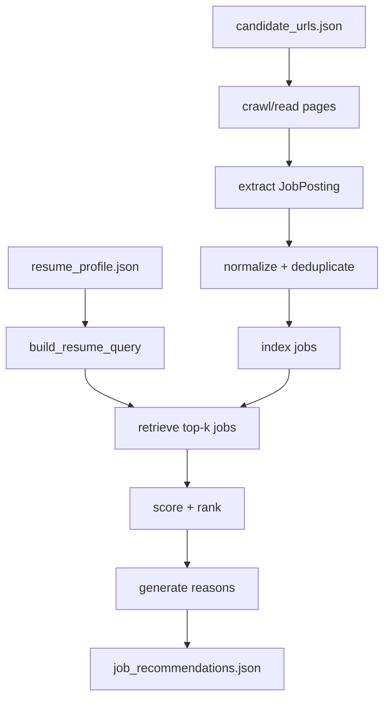

# Part 3 Module Current Status: Browser Use + Job Information RAG

本文档用于帮助团队成员、后端集成同学和项目评审快速理解第 3 部分模块的当前情况。

第 3 部分负责：

```text
Browser Use + 岗位信息 RAG
```

模块目标是从候选岗位页面中读取岗位信息，抽取结构化 JD，构建本地向量检索索引，并根据简历画像输出岗位推荐、匹配理由、不匹配原因和简历修改重点。

本文档只记录模块状态和使用方式，不记录任何真实 API key、真实 base-url 或真实模型名称。

---

## 1. 模块在整体项目中的位置

整体项目共有六个部分：

| 部分 | 内容 | 本模块是否负责 |
|---|---|---|
| 1 | 简历信息提取 + 搜索候选网页 | 否 |
| 2 | AI Agent 前端界面 | 否 |
| 3 | Browser Use + 岗位信息 RAG | 是 |
| 4 | 简历优化与应用层 | 否 |
| 5 | 汇报 PPT + 演示视频 | 否 |
| 6 | 后端编排 + 系统集成 + 评测 | 只提供接口 stub，等待对齐 |

本模块不负责生成候选岗位链接，也不负责最终改写简历。它的职责是把“简历画像 + 候选岗位页面”转成“可解释的岗位推荐结果”。

---

## 2. 输入与输出

### 输入

```text
resume_profile.json
candidate_urls.json
```

其中：

- `resume_profile.json` 由第 1 部分生成，包含学历、技能、项目、实习、目标岗位、目标城市等。
- `candidate_urls.json` 由第 1 部分或搜索模块生成，包含候选岗位 URL 或本地 demo HTML 路径。

### 输出

Demo 默认输出到：

```text
job_rag/examples/outputs/
```

主要输出文件：

| 文件 | 含义 |
|---|---|
| `page_contents.json` | 页面读取结果，包括成功页面和失败 URL |
| `job_postings.json` | 原始岗位抽取结果 |
| `clean_job_postings.json` | 清洗、归一化、去重后的岗位 |
| `vector_index.json` | 本地 JSON 检索索引，默认 backend 使用 |
| `retrieved_jobs.json` | 根据简历召回的候选岗位 |
| `job_recommendations.json` | 最终岗位推荐、分数、理由、不匹配原因和简历修改重点 |

当启用 Chroma 后端时，向量库持久化目录为：

```text
job_rag/examples/outputs/chroma_index/
```

该目录是运行时产物，不应提交到 GitHub。

---

## 3. 当前代码位置

本地仓库路径：

```text
E:\R_store\agent_part3\browser-use-repo
```

远程仓库：

```text
https://github.com/artificial-intelligence233/browser-use
```

当前开发分支：

```text
part3-browser-use-job-rag
```

模块路径：

```text
job_rag/
```

---

## 4. 核心目录结构

```text
job_rag/
├── README.md
├── config.py
├── schemas.py
│
├── crawler/
│   ├── browser_use_adapter.py
│   ├── browser_use_runner.py
│   ├── page_extractor.py
│   └── url_utils.py
│
├── extraction/
│   ├── job_extractor.py
│   ├── normalizer.py
│   ├── prompts.py
│   └── validators.py
│
├── indexing/
│   ├── embedder.py
│   ├── interfaces.py
│   └── vector_store.py
│
├── matching/
│   ├── reason_generator.py
│   ├── retriever.py
│   └── scorer.py
│
├── api/
│   └── routes.py
│
├── examples/
│   ├── run_demo.py
│   ├── sample_resume_profile.json
│   ├── sample_candidate_urls.json
│   ├── local_jobs/
│   └── outputs/
│
├── tests/
└── docs/
```

---

## 5. Pipeline 流程



流程说明：

1. 读取候选岗位 URL 或本地 HTML。
2. 通过 Browser Use、local HTML 或 HTTP fallback 读取页面文本。
3. 抽取岗位标题、公司、地点、薪资、职责、要求、技能等字段。
4. 对城市、薪资、技能做归一化，对重复岗位去重。
5. 将岗位构造成检索文档，写入本地检索索引或 Chroma。
6. 根据简历画像构造 query，召回 top-k 岗位。
7. 计算匹配分数，并生成匹配理由、不匹配原因和简历修改重点。

---

## 6. 已实现能力

| 能力 | 当前状态 |
|---|---|
| `job_rag/` 模块结构 | 已完成 |
| 数据 schema | 已完成 |
| 本地 demo HTML | 已完成 |
| 页面读取 fallback | 已完成 |
| Browser Use 可选适配器 | 已完成代码接入 |
| Playwright / Chromium 本地环境 | 已完成 |
| 岗位规则抽取 | 已完成 |
| LLM 岗位抽取 fallback | 已完成接口接入，默认关闭 |
| 岗位校验 | 已完成 |
| 城市、薪资、技能归一化 | 已完成 |
| 岗位去重 | 已完成 |
| 本地 JSON 检索索引 | 已完成 |
| Chroma 向量库后端 | 已完成 |
| OpenAI-compatible embedding 接口 | 已完成接口，不记录真实配置 |
| 简历 query 构造 | 已完成 |
| 岗位匹配评分 | 已完成 |
| 匹配理由 / 不匹配原因 / 简历修改重点 | 已完成 |
| API stub | 已完成初版 |
| 单元测试 | 已完成 |

---

## 7. 当前检索与向量库设计

检索层已经改为可插拔结构：

```text
index_jobs / search_jobs
-> get_vector_store_backend()
-> VectorStoreBackend
-> EmbeddingProvider
```

当前支持两个 vector backend：

| backend | 配置值 | 说明 |
|---|---|---|
| Local JSON | `local` | 默认，无外部依赖，适合离线 demo |
| Chroma | `chroma` | 正式本地持久化向量库，适合严格实现 |

当前支持两个 embedding provider：

| provider | 配置值 | 说明 |
|---|---|---|
| Local token embedding | `local` | 默认，离线可运行 |
| OpenAI-compatible API | `openai_compatible` | 只读取本地环境变量，不硬编码真实配置 |

当前还支持可选 LLM 抽取 fallback：

| 能力 | 配置值 | 说明 |
|---|---|---|
| 规则抽取 | 默认 | 标准 JD 页面优先使用，离线可运行 |
| 聊天模型抽取 | `JOB_RAG_ENABLE_LLM_EXTRACTION=1` | 规则抽取低置信度时调用，用于论坛帖、自然语言招聘帖等非标准页面 |

---

## 8. 本地运行方式

### 默认离线 demo

```powershell
D:\Conda\envs\job_rag_browser_use\python.exe job_rag\examples\run_demo.py
```

该模式使用：

```text
JOB_RAG_VECTOR_BACKEND=local
JOB_RAG_EMBEDDING_PROVIDER=local
```

不需要 API key，不需要真实网页。

### Chroma backend demo

```powershell
$env:JOB_RAG_VECTOR_BACKEND="chroma"
$env:JOB_RAG_CHROMA_DIR="E:\R_store\agent_part3\browser-use-repo\job_rag\examples\outputs\chroma_index"
D:\Conda\envs\job_rag_browser_use\python.exe job_rag\examples\run_demo.py
```

该模式会把岗位向量持久化到 Chroma。

### OpenAI-compatible embedding demo

真实配置只能在本地终端设置，不能写入仓库：

```powershell
$env:JOB_RAG_EMBEDDING_PROVIDER="openai_compatible"
$env:JOB_RAG_EMBEDDING_BASE_URL="<set locally>"
$env:JOB_RAG_EMBEDDING_MODEL="<set locally>"
$env:JOB_RAG_EMBEDDING_API_KEY="<set locally>"
$env:JOB_RAG_VECTOR_BACKEND="chroma"
$env:JOB_RAG_CHROMA_DIR="E:\R_store\agent_part3\browser-use-repo\job_rag\examples\outputs\chroma_index"
D:\Conda\envs\job_rag_browser_use\python.exe job_rag\examples\run_demo.py
```

当前已经在本地验证过一组 OpenAI-compatible embedding API 可以返回 1024 维向量，并能跑通 Chroma demo。真实服务地址、模型名和 key 不记录在本文档中。

### LLM 抽取 fallback

非标准招聘页面可启用聊天模型抽取：

```powershell
$env:JOB_RAG_ENABLE_LLM_EXTRACTION="1"
$env:JOB_RAG_LLM_BASE_URL="<set locally>"
$env:JOB_RAG_LLM_MODEL="<set locally>"
$env:JOB_RAG_LLM_API_KEY="<set locally>"
```

该能力只在规则抽取无效或低置信度时调用，输出 JSON 后仍走现有校验与归一化流程。

---

## 9. 当前环境

Python / conda 环境：

```text
D:\Conda\envs\job_rag_browser_use
```

已安装关键依赖：

```text
browser-use 0.12.6
playwright 1.59.0
chromadb 1.5.8
pytest 9.0.3
```

Playwright / Chromium 本地缓存根目录：

```text
D:\agent_part3
```

当前 Playwright 组件目录：

```text
D:\agent_part3\chromium-1217
D:\agent_part3\chromium_headless_shell-1217
D:\agent_part3\ffmpeg-1011
D:\agent_part3\winldd-1007
```

说明：

```text
Chromium 是 Playwright/Browser Use 的本地浏览器缓存，不在 conda 环境内。
```

---

## 10. 验证结果

测试命令：

```powershell
D:\Conda\envs\job_rag_browser_use\python.exe -m pytest -o addopts= job_rag\tests
```

当前结果：

```text
16 passed
```

Demo 验证：

```text
local backend demo: passed
Chroma backend demo: passed
OpenAI-compatible embedding + Chroma demo: passed locally
```

Playwright headless Chromium 启动验证：

```text
passed
```

---

## 11. API Stub

当前提供初版 API stub：

```text
job_rag/api/routes.py
```

设计目标接口：

```text
/crawl_jobs
/recommend_jobs
```

当前状态：

```text
接口结构已有，但仍需与第 6 部分后端编排同学确认最终请求字段、响应字段、错误格式和 run_id 传递方式。
```

---

## 12. 安全与合规规则

必须遵守：

- 只处理公开可访问岗位页面或本地 demo HTML。
- 不绕过登录、验证码、付费墙、访问限制或反爬机制。
- 不进行高频、大规模或商业爬取。
- 不采集岗位页面以外的无关个人信息。
- 不编造简历事实、学历、经历、技能、项目或奖项。
- 匹配理由必须基于简历画像和岗位文本。
- 单个 URL 失败不能导致整个 pipeline 崩溃。

敏感配置规则：

- 真实 API key、base-url、模型名只能在本地运行时使用。
- 严禁写入 Git、Markdown、README、Python 脚本、PowerShell 脚本、测试文件、示例 JSON、commit message 或 PR 描述。
- 代码中只允许读取通用环境变量名。

---

## 13. 当前仍缺少的工作

| 缺少项 | 说明 | 优先级 |
|---|---|---|
| 真实公开岗位 URL 验证 | 需要用不登录、不验证码的真实招聘页面验证 Browser Use 读取和抽取效果 | 高 |
| 与第 6 部分后端 API 对齐 | 需要确认 `/crawl_jobs`、`/recommend_jobs` 最终字段 | 高 |
| 真实简历画像评测 | 需要用脱敏简历 profile 验证推荐是否合理 | 中 |
| 抽取规则增强 | 根据真实网页格式补充中文招聘页面规则 | 中 |
| 真实 LLM 抽取验证 | 需要使用本地配置的聊天模型验证 V2EX 等非标准招聘帖 | 中 |
| PR / 合并流程 | 当前只 push 到个人分支，尚未创建 PR，尚未合并 main | 低 |

---

## 14. 当前结论

第 3 部分的核心 MVP 已经完成：

```text
读取岗位页面
-> 抽取岗位信息
-> 清洗归一化
-> Chroma / local 检索
-> 根据简历召回岗位
-> 计算匹配分数
-> 输出匹配理由、不匹配原因、简历修改重点
```

目前主要进入真实集成验证阶段。基础代码结构、离线 demo、本地 Chroma 后端和 OpenAI-compatible embedding 接口已经具备。
