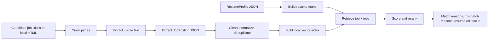

# Part 3 PPT Notes

## Module Goal

Convert candidate job pages into structured, searchable, explainable job
recommendations based on a structured resume profile.

## Architecture



## Current MVP

- Uses local HTML job pages for stable demo input.
- Supports public HTTP/HTTPS pages through a conservative fallback crawler.
- Uses rule-based extraction as the no-LLM fallback.
- Uses a local JSON vector index based on token cosine similarity.
- Produces frontend/backend-ready JSON outputs.

## Demo Output Files

```text
job_rag/examples/outputs/page_contents.json
job_rag/examples/outputs/job_postings.json
job_rag/examples/outputs/clean_job_postings.json
job_rag/examples/outputs/retrieved_jobs.json
job_rag/examples/outputs/job_recommendations.json
```

